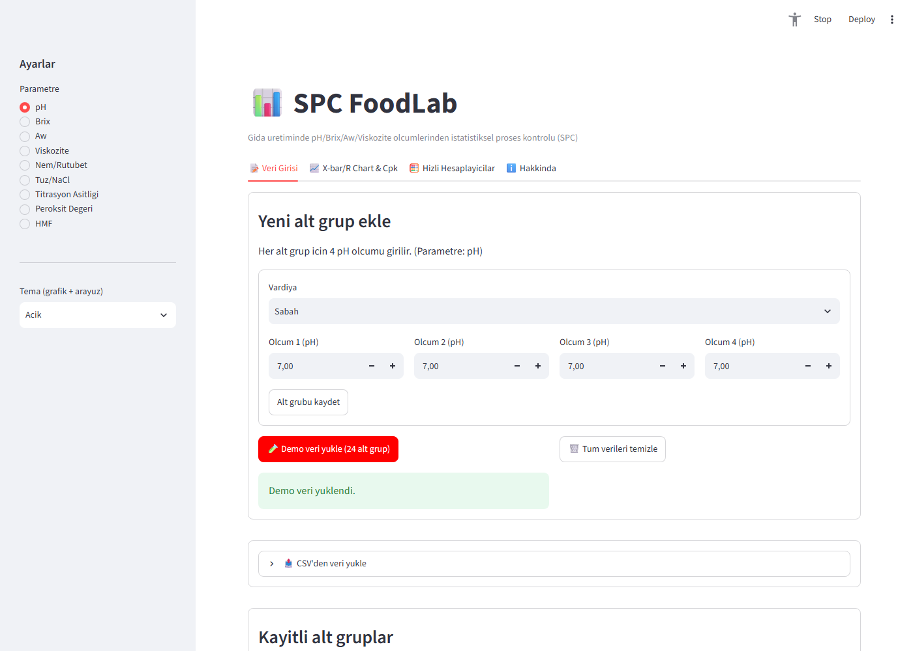
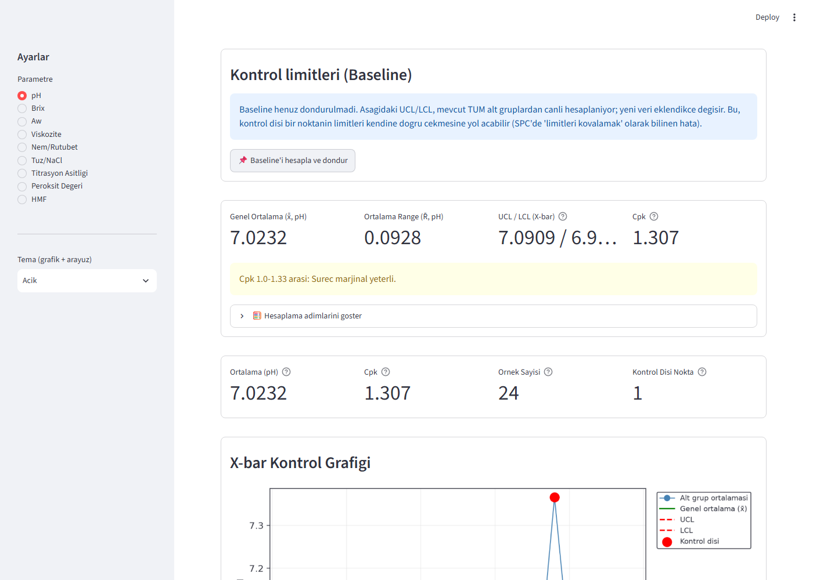
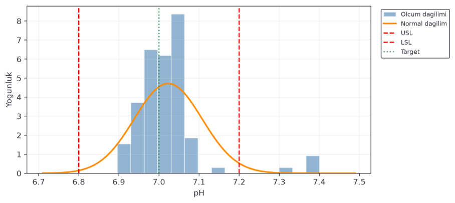
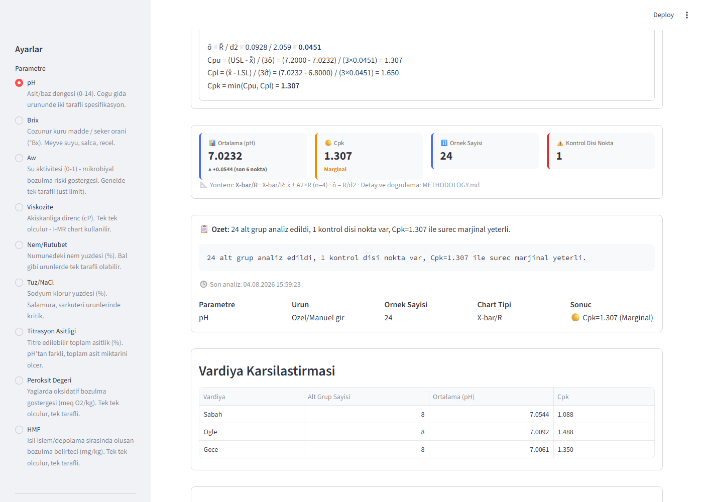
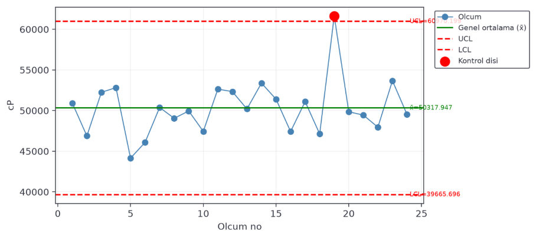

# 📊 SPC FoodLab

[](https://github.com/aliarsln209-glitch/spc-foodlab/actions/workflows/tests.yml)

Gıda üretiminde pH, Brix, aw (su aktivitesi), viskozite, nem/rutubet,
tuz/NaCl, titrasyon asitliği, peroksit değeri veya HMF ölçümlerinden
**istatistiksel proses kontrolü (SPC)** grafiği ve **süreç yeterlilik
analizi (Cpk/Cpu)** üreten bir Streamlit uygulaması.

🔗 **Demo:** [spc-foodlab-4qhdg4ozkknrpnhwj5pxxm.streamlit.app](https://spc-foodlab-4qhdg4ozkknrpnhwj5pxxm.streamlit.app/)

## English summary

SPC FoodLab turns routine food-quality lab measurements into proper
**Statistical Process Control (SPC)** charts and **process capability
(Cpk/Cpu)** analysis, instead of just logging numbers.

- **Two chart engines:** X-bar/R for subgroup-based parameters (pH,
  Brix, aw, moisture, salt, titratable acidity), and Individual-Moving
  Range (I-MR) for parameters measured one value at a time (viscosity,
  peroxide value, HMF).
- **One- or two-sided Cpk**, resolved automatically per *product* —
  e.g. honey's moisture spec only has an upper limit (per Turkish Food
  Codex), so it gets a one-sided Cpu automatically while other products
  under the same parameter stay two-sided.
- Every formula and constant (A2/D3/D4/d2, the I-chart's 2.66 constant,
  Cpk/Cpu, including the R̄=0 edge case) is validated against a
  textbook or industry worked example before being trusted — see
  `tests/` (27 automated tests across 4 files, run on every push via
  GitHub Actions — see badge above).
- Result dashboard with a Cpk/Cpu level badge, an auto-generated plain-text
  summary, a shift-by-shift comparison table, and a one-page PDF report
  export — on top of the existing PNG chart export and CSV import/export.
- Built with Python + Streamlit, deployed on Streamlit Community
  Cloud. Independent, individually-developed project (built to apply
  SPC/quality-engineering coursework to a real, deployed tool).

## Ekran görüntüleri

| | |
|---|---|
|  |  |
| Veri girişi + CSV import | KPI paneli ve X-bar/R chart |
|  |  |
| Süreç yeterlilik histogramı | Formül hesaplama adımları (şeffaflık) |
|  | |
| I-MR chart (Viskozite) | |

## Desteklenen parametreler

| Parametre | Chart | Birim |
|---|---|---|
| pH | X-bar/R | pH |
| Brix | X-bar/R | °Bx |
| Aw (su aktivitesi) | X-bar/R | aw (0–1) |
| Nem/Rutubet | X-bar/R | % |
| Tuz/NaCl | X-bar/R | % |
| Titrasyon Asitliği | X-bar/R | % |
| Viskozite | I-MR | cP |
| Peroksit Değeri | I-MR | meq O2/kg |
| HMF | I-MR | mg/kg |

Tek/iki taraflı Cpk mantığı **ürün bazında** otomatik belirlenir (örn.
Bal'ın nem spesifikasyonunda sadece üst limit vardır); alt grup büyüklüğü
(n) sidebar'dan seçilebilir (varsayılan n=4, aralık n=2–10) — detaylı
mantık ve kaynaklar için [METHODOLOGY.md](METHODOLOGY.md).

**Kapsam dışı (v1'de yok):** çoklu parametre karşılaştırma, Western
Electric kuralları, kullanıcı hesabı/çoklu kullanıcı sistemi, veritabanı
entegrasyonu (session-state + CSV export yeterli).

## Hızlı Hesaplayıcılar — Totox

Ayrı bir sekmede, SPC akışından izole, tek seferlik bir hesaplayıcı:
`Totox = 2 × Peroksit Değeri + Anisidin Değeri`. Kullanıcı iki değeri
elle girer, sonuç anında hesaplanır.

## Nasıl çalıştırılır

**Local:**
```bash
pip install -r requirements.txt
cd src
streamlit run app.py
```
Uygulama varsayılan olarak `http://localhost:8501` üzerinde açılır.

**Demo:** [spc-foodlab-4qhdg4ozkknrpnhwj5pxxm.streamlit.app](https://spc-foodlab-4qhdg4ozkknrpnhwj5pxxm.streamlit.app/)

## Teknik yığın

- **Streamlit** (Python) — form, hesaplama ve grafik tek pakette
- **matplotlib + scipy** — kontrol grafikleri ve kapasite histogramı
- **fpdf2** — tek sayfalık PDF analiz raporu export'u
- **Deploy:** Streamlit Community Cloud
- Veri kalıcılığı: session-state (uygulama içi) + CSV export — v1'de
  veritabanı entegrasyonu yok

## Proje yapısı

```
spc-foodlab/
├── .github/workflows/
│   └── tests.yml        # Her push'ta pytest calistiran GitHub Actions CI
├── src/
│   ├── app.py             # Streamlit arayüzü (4 sekme)
│   ├── spc_core.py        # X-bar/R, I-MR ve Cpk hesaplama çekirdeği
│   ├── result_helpers.py  # Cpk rozeti, trend göstergesi, quick summary, demo senaryosu hedefleri
│   ├── demo_data.py       # Kontrollü simülasyon veri üreteci (alt grup + bireysel)
│   └── constants.py       # Sabit yapılandırma (varsayılan n=4, parametre/ürün/kaynak tabloları)
├── tests/
│   ├── test_validation.py       # X-bar/R formül doğrulama testi (pH örneği)
│   ├── test_imr_validation.py   # I-MR formül doğrulama testi (kahve sıcaklığı örneği)
│   ├── test_cpk_edge_cases.py   # Sıfır-varyasyon (R̄/MR̄=0) edge case testleri
│   └── test_result_helpers.py   # Rozet/trend/özet/demo-senaryosu testleri (result_helpers.py)
├── screenshots/         # README ekran görüntüleri
├── METHODOLOGY.md       # Formüller, doğrulama, ürün referans kaynakları
└── requirements.txt
```

---

📖 Detaylı formüller ve doğrulama metodolojisi için: [METHODOLOGY.md](METHODOLOGY.md)
